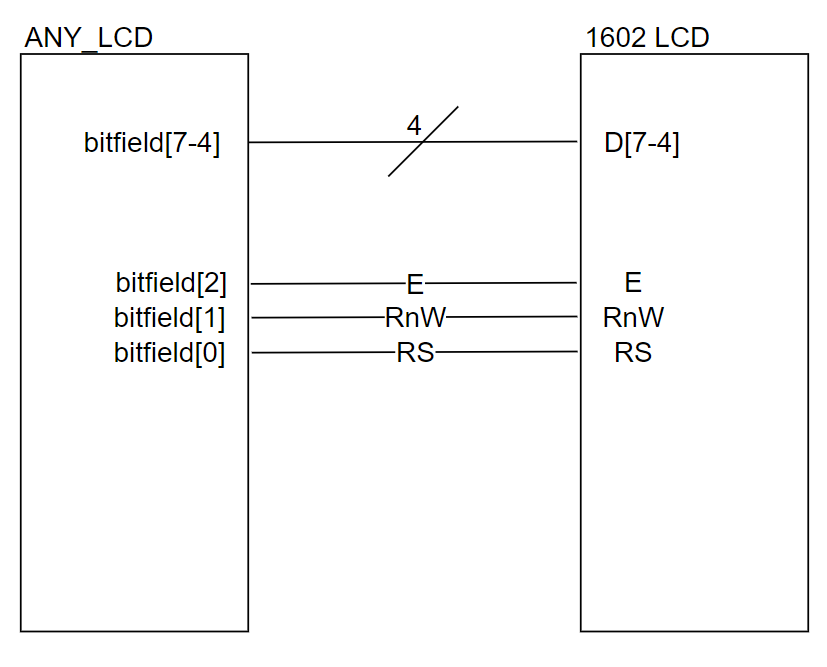

# ANY_LCD
ANY_LCD is a general purpose abstraction layer for interfacing a microcontroller with a 1602 style LCD. This was meant to decouple the commonly used 
lcd 1602 logic layer from the IO implementation on your microcontroller. The user will still need to provide all of the peripheral interfacing (GPIO, I2C, etc) but ANY_LCD will handle the logical layer.

NOTE: this library should be usable on basically any microcontroller that's interfaced with a 1602

Example MCUs I've used: \
TI TM4C123GH6PM \
TI MSP432 \
PIC18F \
TI TMS320F28379D DSP 

## KNOWLEDGE 
Here's a refresher on C structs, C function pointers, and bitwise operators \
Function pointers: https://www.geeksforgeeks.org/function-pointer-in-c/  \
Structs: https://www.geeksforgeeks.org/structures-c/ \
Bitwise Operators: https://www.geeksforgeeks.org/bitwise-operators-in-c-cpp/ 

## HOW TO USE
You can just drop this directly into your workspace directory along side your other source files and 

#include "ANY_LCD.h"

## HARDWARE WIRING 
In this code, you are provided the below struct which instructs how the code interprets the input bitfield. It expects the bits to arrive 
in the below format.

NOTE: Currently only supports 4 bit mode as that's also compatible with I2C modules available for the 1602.

### SNIPPET FROM ANY_LCD.h
 ```
 typedef struct any_lcd{
	
	/*********************************
	 * NAME: lcd_write 
	 * DESC: This function is used by the 
	 * driver to write data to the lcd 
	 *
	 * NOTE: hardware interface for writing  
	 * data to  lcd
	 * HARDWARE NOTE: 
	 *	FOR LCD WIRING
	 *	BIT 7-4 -> LCD DATA 7-4
	 *	BIT 3   -> LCD LED PIN(if it exists/for i2c)
	 *	BIT 2   -> LCD E 
	 *	BIT 1   -> LCD RW
	 *	BIT 0   -> LCD RS  
	 *
	 * PARALLEL INTERFACE NOTE:
	 * IGNORE the LED pin
	 *
	 ********************************/
	void (*lcd_write)(uint8_t bitfield);
	
	/************************************
	 * Name: Delay us 
	 * Desc: delay microseconds  
	 ***********************************/
	void (*delay_us)(uint32_t microseconds);
	
}any_lcd_t;
 ```
### WIRING DIAGRAM
 
 
### Example LCDs on Amazon
I2C:
https://www.amazon.com/GeeekPi-Character-Backlight-Raspberry-Electrical/dp/B07S7PJYM6/ref=asc_df_B07S7PJYM6?tag=bingshoppinga-20&linkCode=df0&hvadid=80401897095985&hvnetw=o&hvqmt=e&hvbmt=be&hvdev=c&hvlocint=&hvlocphy=&hvtargid=pla-4584001428555906&psc=1

Parallel (no I2C module soldered)
https://www.amazon.com/HiLetgo-Display-Backlight-Controller-Character/dp/B00HJ6AFW6/ref=pd_lpo_1?pd_rd_i=B00HJ6AFW6&psc=1
 
## CODE EXAMPLES 

### Using ANY_LCD
This snippet will write a string to your connected LCD:
```
  user_GPIO_Init(); //user must initialize own gpio/peripheral 

  /****LCD INIT*****/
  any_lcd_t lcd;
  lcd.delay_us  = &DelayUS;
  lcd.lcd_write = &WriteLCD;
  LCD_Init(lcd); //will initialize lcd "logically" ie send the correct commands for 4 bit mode

  char *str = "ANY LCD";
  LCD_WriteString(str,lcd);
  
```
Another example using sprintf to display some data from a sensor:
```
int main(){
  user_GPIO_Init(); //user must initialize own gpio/peripheral 

  /****LCD INIT*****/
  any_lcd_t lcd;
  lcd.delay_us  = &DelayUS;
  lcd.lcd_write = &WriteLCD;
  LCD_Init(lcd); //will initialize lcd "logically" ie send the correct commands for 4 bit mode

  char buffer[32];
  
  while(1){
 
    LCD_Reset(); //clear and reset cursor
    uint8_t data = read_sensor(); //use your imagination, could be ADC or some SPI peripheral
    sprintf(buffer,"Sensor Value: %d",data);
    LCD_WriteString(buffer,lcd);
    DelayUS(1E6); //delay 1 second
 
  }
  
}
```

In these examples, the WriteLCD function can be any write function that's connected to your LCD. DelayUS should be some kind of delay function that allows 
microsecond increments (could technically work with larger time deltas but would make LCD very slow). 

### WriteLCD examples for lcd.lcd_write:
Note, PORTA 3 would be tied to something other than the LCD 
```
void WriteLCD(uint8_t bitfield){

  /*****************
   ASSUMING:
   PORTA 7-4 -> LCD D 7-4
   PORTA 2 -> LCD E 
   PORTA 1 -> LCD RW 
   PORTA 0 -> LCD RS 
  ******************/
   PORTA = bitfield; 
}
```

Example where PORTA bits 7-1 are all in use but PORTA 0 is left floating.
This may be a preferable setup for hardware layout
```
void WriteLCD(uint8_t bitfield){

  /*****************
   ASSUMING:
   PORTA 7-4 -> LCD D 7-4
   PORTA 3 -> LCD E  (bitfield 2)
   PORTA 2 -> LCD RW (bitfield 1)
   PORTA 1 -> LCD RS (bitfield 0)
  ******************/
  uint8_t high_nibble = bitfield & 0xF0;
  uint8_t low_nibble = (bitfield << 1) & 0x0F; 
  bitfield = high_nibble | low_nibble;
  
  PORTA = bitfield; 
}
```

Maybe the LCD is connected to two different ports
```
void WriteLCD(uint8_t bitfield){

  /*****************
   ASSUMING:
   PORTA 7-4 -> LCD D 7-4
   PORTB 7 -> LCD E  (bitfield 2)
   PORTB 6 -> LCD RW (bitfield 1)
   PORTB 5 -> LCD RS (bitfield 0)
  ******************/
  uint8_t porta_nibble = bitfield &= 0xF0;
  uint8_t portb_nibble = (bitfield & 0x0F) << 5; //we want bit 2 -> 7 so we shift by 5
 
  PORTA = porta_nibble;
  PORTB = portb_nibble;
}
```
